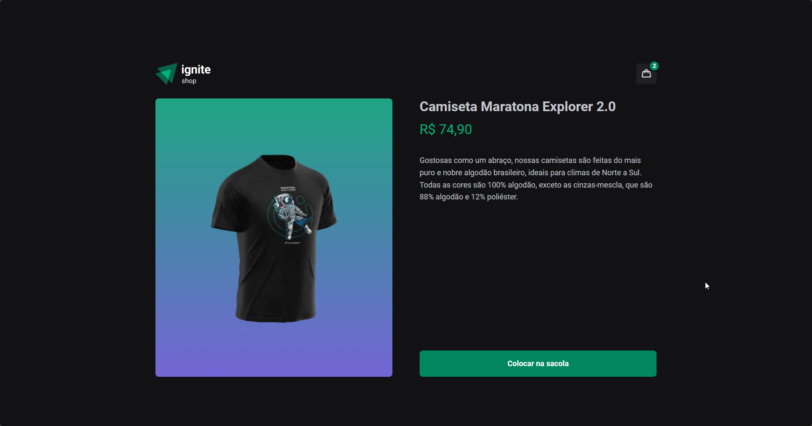
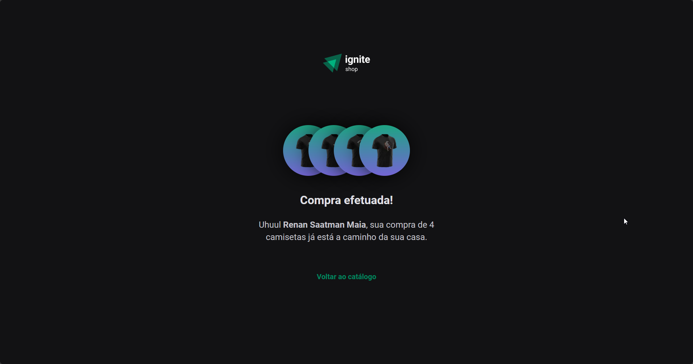

# Ignite Shop 2.0 - Challenge 4 | Rocketseat :rocket:

Fourth challenge of the Rocketseat Ignite Course.

### :hammer_and_wrench: Tools:

- Nextjs
- React
- Typescript
- Stitches
- Stripe API

### :white_check_mark: What you can do:

- Add an item into cart
- Open the item page and add it into cart
- Remove an item from the cart

### :camera: Screenshots

:computer: For desktop

    
    
    

